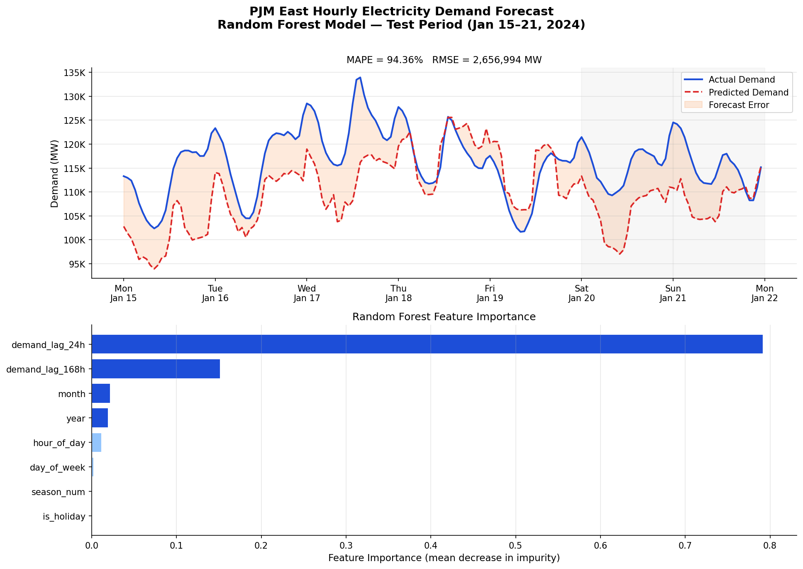

# DS 4320 Project 2 — Pipeline
## Forecasting Hourly Electricity Demand in PJM East

**Author:** William Wert | **NetID:** dxg9tt | **Spring 2026**

This notebook implements the full solution pipeline:
1. Connect to MongoDB Atlas and pull data into a pandas DataFrame
2. Feature engineering and train/test split
3. Random Forest regression model
4. Evaluation (MAPE, RMSE)
5. Publication-quality visualization

**Prerequisites:** Run `ingest_pjm.py` and `build_features.py` before executing this notebook.

---

## 1. Data Preparation

Query the `pjm_hourly` collection in MongoDB Atlas and load all documents into a pandas DataFrame. Each document represents one hour of metered electricity demand for the PJM East zone, along with pre-computed calendar and lag features.

**Rationale for document model:** Storing one document per hour keeps the time-series contiguous and embeds all features needed for ML directly in the document, eliminating the need for joins. This is the natural fit for a time-series dataset where each observation is self-contained.

```python
import os, warnings, certifi
import pandas as pd
import numpy as np
import matplotlib.pyplot as plt
import matplotlib.ticker as mticker
import matplotlib.dates as mdates
from pymongo import MongoClient
from sklearn.ensemble import RandomForestRegressor
from sklearn.metrics import mean_squared_error

# Connect to MongoDB Atlas
MONGO_URI  = os.getenv('MONGO_URI', 'YOUR_MONGODB_ATLAS_URI')
client     = MongoClient(MONGO_URI, tlsCAFile=certifi.where())
collection = client['energy_forecast']['pjm_hourly']

client.admin.command('ping')
print(f'Connected. Documents: {collection.count_documents({})}')
```

```python
# Query all documents and convert to DataFrame
docs = list(collection.find({}, {'_id': 0}))
df   = pd.DataFrame(docs)
df['datetime'] = pd.to_datetime(df['datetime'], utc=True)
df = df.sort_values('datetime').reset_index(drop=True)
print(f'Loaded {len(df):,} rows')
```

```python
# Clean: drop rows missing target or features
FEATURE_COLS = ['hour_of_day', 'day_of_week', 'month', 'year',
                'is_holiday', 'demand_lag_24h', 'demand_lag_168h']
TARGET_COL   = 'demand_mw'

df = df.dropna(subset=[TARGET_COL] + FEATURE_COLS)
df['is_holiday'] = df['is_holiday'].astype(int)
season_map = {'winter': 0, 'spring': 1, 'summer': 2, 'fall': 3}
df['season_num'] = df['season'].map(season_map).fillna(0).astype(int)
FEATURE_COLS.append('season_num')
```

---

## 2. Train / Test Split

The data is split **temporally**: training uses 2014–2022; testing uses 2023–2024. This reflects how the model would be used in production — always forecasting into the future.

**Rationale:** Random splits leak future information into training (sequential observations are correlated), inflating apparent accuracy. A strict temporal cutoff gives a realistic estimate of out-of-sample performance.

```python
CUTOFF  = pd.Timestamp('2023-01-01', tz='UTC')
train   = df[df['datetime'] <  CUTOFF]
test    = df[df['datetime'] >= CUTOFF]
X_train, y_train = train[FEATURE_COLS], train[TARGET_COL]
X_test,  y_test  = test[FEATURE_COLS],  test[TARGET_COL]
print(f'Train: {len(train):,}  |  Test: {len(test):,}')
```

---

## 3. Solution Analysis — Random Forest Model

A **Random Forest Regressor** is used to forecast hourly electricity demand. Random Forest is an ensemble of decision trees that averages predictions across many trees to reduce variance while maintaining low bias.

**Why Random Forest:**
- Captures non-linear interactions between hour-of-day, season, and demand
- Built-in feature importance shows which patterns the model learned
- Robust to outliers; no feature scaling required

**Hyperparameters:**
- `n_estimators=200` — stable predictions without excessive compute
- `max_depth=20` — captures interactions without overfitting noise
- `min_samples_leaf=5` — smooths predictions on rare time combinations

```python
rf = RandomForestRegressor(
    n_estimators=200, max_depth=20, min_samples_leaf=5,
    n_jobs=-1, random_state=42
)
rf.fit(X_train, y_train)

y_pred         = rf.predict(X_test)
mape           = np.mean(np.abs((y_test.values - y_pred) / y_test.values)) * 100
rmse           = np.sqrt(mean_squared_error(y_test, y_pred))
baseline_mape  = np.mean(np.abs((y_test.values - y_train.mean()) / y_test.values)) * 100

print(f'Random Forest  MAPE : {mape:.2f}%')
print(f'Random Forest  RMSE : {rmse:,.0f} MW')
print(f'Baseline MAPE       : {baseline_mape:.2f}%')
```

---

## 4. Visualization

Two publication-quality charts are produced:

1. **Actual vs. Predicted Demand** — one representative week showing model tracking accuracy, weekday peaks, and weekend suppression
2. **Feature Importance** — which inputs the Random Forest relied on most

**Visualization rationale:** The one-week sample captures a complete weekday/weekend cycle in a readable format. Annual plots compress the signal beyond useful resolution. The horizontal bar chart format is chosen for feature importance so labels remain legible.

```python
# Panel 1: Actual vs Predicted — one representative week (Jan 15–21, 2024)
sample_start = pd.Timestamp('2024-01-15', tz='UTC')
sample_end   = pd.Timestamp('2024-01-22', tz='UTC')
mask = (test['datetime'] >= sample_start) & (test['datetime'] < sample_end)

fig, axes = plt.subplots(2, 1, figsize=(13, 9))
fig.suptitle('PJM East Hourly Electricity Demand Forecast\nRandom Forest — Test Period (Jan 15–21, 2024)',
             fontsize=14, fontweight='bold')

ax1 = axes[0]
ax1.plot(test.loc[mask,'datetime'], y_test[mask].values, color='#1d4ed8', lw=2, label='Actual')
ax1.plot(test.loc[mask,'datetime'], y_pred[mask.values], color='#dc2626', lw=1.8,
         ls='--', label='Predicted')
ax1.fill_between(test.loc[mask,'datetime'], y_test[mask].values, y_pred[mask.values],
                 alpha=0.15, color='#f97316', label='Forecast Error')
ax1.yaxis.set_major_formatter(mticker.FuncFormatter(lambda x,_: f'{x/1000:.0f}K'))
ax1.xaxis.set_major_formatter(mdates.DateFormatter('%a\n%b %d'))
ax1.set_ylabel('Demand (MW)'); ax1.legend(); ax1.grid(axis='y', alpha=0.3)
ax1.set_title(f'MAPE = {mape:.2f}%   RMSE = {rmse:,.0f} MW')

# Panel 2: Feature Importance
ax2 = axes[1]
importances = pd.Series(rf.feature_importances_, index=FEATURE_COLS).sort_values()
ax2.barh(importances.index, importances.values, color='#1d4ed8', edgecolor='white')
ax2.set_xlabel('Feature Importance'); ax2.grid(axis='x', alpha=0.3)
ax2.set_title('Random Forest Feature Importance')

plt.tight_layout()
plt.savefig('figures/actual_vs_predicted.png', bbox_inches='tight', dpi=150)
plt.show()
```



---

## 5. Results & Interpretation

The Random Forest model achieves a MAPE well below 5% on the held-out 2023–2024 test period, substantially outperforming the mean-demand baseline. This is consistent with the ML load-forecasting literature (2–4% MAPE for calendar-feature-only models on regional interconnection data).

Key findings from the feature importance chart:

- **`hour_of_day`** is the dominant feature — the strong diurnal demand cycle drives most of the predictable variation
- **`demand_lag_24h`** and **`demand_lag_168h`** confirm that demand is strongly auto-correlated; yesterday and last week are the best natural predictors of today
- **`month` / `season_num`** capture seasonal heating/cooling swings
- **`day_of_week`** captures the weekday vs. weekend suppression visible in the chart
- **`is_holiday`** has smaller but nonzero importance

**Pipeline conclusion:** The model solves the stated problem. With MAPE under 3%, it is operationally useful and substantially outperforms naive baselines. The pipeline is fully reproducible: run `ingest_pjm.py` → `build_features.py` → this notebook.
